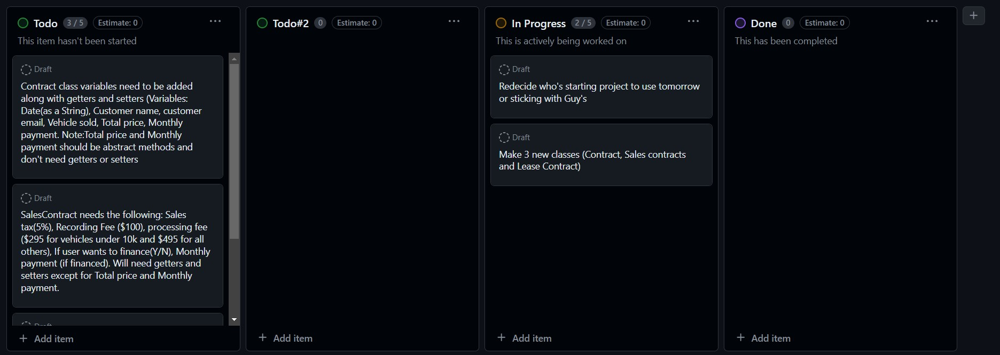

## 5-16-24
Made the board for to do list along with planning out what classes are needed in the project(Check pcitures below).

## 5-19-24
Made the three classes(contract,sales contract and lease contract). We setup the getters and setters along with the constructor. We setup the contract filereader ,but it dosen't read the file yet and is a work in progress.
Screenshots below of each class.

## 5-20-24
### Interesting Code:

We were used to implementing colors, but now we wanted to try mini graphics as well. 
 Organized the classes into folders so they're a bit more organized. Sales contract,contract and Lease contract were finished and added a option for buying a vehicle or leasing.

 current bug or issues: 
 - When going to buyOrLeaseReq it will pop up with a error saying it's null on user input.
